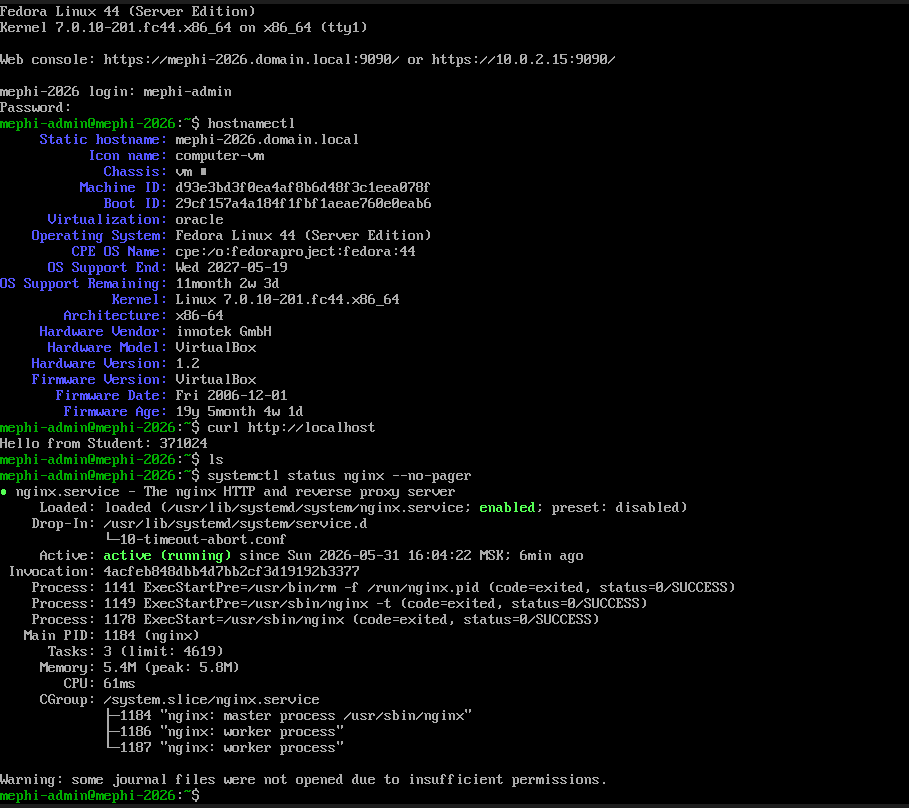

# Сессионный проект по курсу «Операционные системы семейства Unix»

Выполнил студент группы М25-555 Шинкаренко Виктория

## Описание проекта

В рамках сессионного проекта была выполнена настройка серверной системы на базе Fedora Server 44.

Выполнены следующие задачи:

* настройка сети и hostname;
* проверка сетевой связности;
* установка и настройка nginx;
* установка и настройка tcpdump;
* работа с RPM-пакетами;
* создание и монтирование файловой системы ext4;
* настройка автоматического монтирования через `/etc/fstab`;
* создание пользователей и групп;
* настройка прав доступа;
* настройка SELinux;
* настройка Linux capabilities для tcpdump;
* ограничение входа root через PAM;
* публикация web-страницы с персональным идентификатором студента.

## Проверка web-сервера

Результат проверки:

```text id="5h85k0"
Hello from Student: 371024
```

## Содержимое репозитория

В репозитории находятся следующие файлы:

* `project_history.txt`
* `network_check.txt`
* `nginx_recent_logs.txt`
* `fstab.txt`
* `selinux_status.txt`
* `file_contexts.txt`
* `tcpdump_capabilities.txt`
* `permissions.txt`
* `users_groups.txt`
* `index.html`
* `curl_output.txt`
* `mephi-nginx-screenshot.png`

## Используемая система

* Fedora Server 44
* nginx
* SELinux
* ext4
* systemd
* NetworkManager

## Скриншот результата

На скриншоте показаны:
* вход под пользователем `mephi-admin`;
* hostname системы;
* работающий сервис nginx;
* результат проверки `curl http://localhost`;
* отображение страницы:
```text id="r4imxt"
Hello from Student: 371024
```

## Примечание по сетевой настройке

В исходном задании требовалась настройка статического IP-адреса:
```text id="u7d38k"
192.168.1.100/24
```
со шлюзом:
```text id="n4fz2x"
192.168.1.1
```
и DNS-сервером:
```text id="yk1hxt"
8.8.8.8
```
Однако в процессе выполнения проекта виртуальная машина работала в стандартном режиме NAT VirtualBox.
При использовании NAT VirtualBox автоматически назначает виртуальной машине адреса вида:
```text id="pqv8m6"
10.0.2.x
```
и использует собственный виртуальный шлюз:
```text id="h7r64i"
10.0.2.2
```
Поэтому проверка сетевой связности выполнялась через NAT-сеть VirtualBox с сохранением полной работоспособности:
* доступ в интернет;
* работа DNS;
* работа nginx и сетевых сервисов.

Использование NAT было выбрано для стабильной локальной работы проекта в среде VirtualBox.
